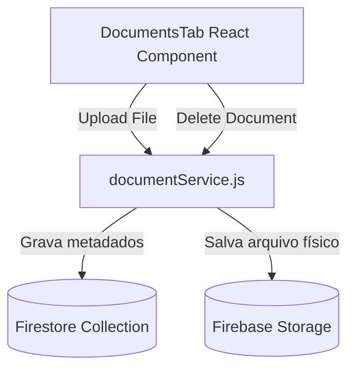

# Documentação: Funcionalidade de Upload de Documentos

Esta documentação detalha a arquitetura, o fluxo de dados e os procedimentos de manutenção para a funcionalidade de upload e gerenciamento de arquivos clínicos dos pacientes (laudos, exames, encaminhamentos e relatórios em PDF, TXT, MD, PNG, JPEG, etc.).

---

## 1. Objetivo

Permitir que os fonoaudiólogos anexem documentos importantes diretamente ao prontuário eletrônico de cada paciente. A funcionalidade oferece suporte a múltiplos formatos, validação de tamanho de arquivo, progresso em tempo real, visualização/download e exclusão segura dos anexos.

---

## 2. Arquitetura

A funcionalidade é estruturada em três camadas integradas:



### Componentes de Software:
1. **Frontend / Componentes React (`/src/components/patients`)**:
   - `DocumentsTab.jsx`: Interface do usuário contendo a área de drag & drop, indicador de progresso (barra de progresso) e listagem dos arquivos com base no tipo.
   - `EvolutionModal.jsx`: Modal que atua como container, integrando a aba "Documentos e Anexos" ao lado de "Histórico e Evoluções" e "Anamnese".
2. **Serviços (`/src/services`)**:
   - `documentService.js`: Gerenciador de chamadas da API do Firebase. Expõe funções para upload (`uploadDocument`), escuta em tempo real (`subscribeDocuments`) e remoção (`deleteDocument`).
3. **Persistência (Firebase)**:
   - **Firebase Storage**: Pasta `/patients/{patientId}/{timestamp}_{filename}` armazena os arquivos binários.
   - **Cloud Firestore**: Subcoleção `/patients/{patientId}/documents/{docId}` armazena metadados do documento:
     - `name`: Nome original do arquivo.
     - `url`: Link de download público (tokenizado pelo Firebase).
     - `type`: Tipo MIME do arquivo (ex: `application/pdf`).
     - `size`: Tamanho em bytes.
     - `storagePath`: Caminho do arquivo físico no Storage (usado para exclusão).
     - `createdAt`: Timestamp do servidor Firestore.

---

## 3. Segurança

### Regras do Firestore (`firestore.rules`)
Adicionamos uma regra explícita de segurança na subcoleção de documentos de forma que apenas o profissional proprietário do paciente tenha permissão de leitura, criação e exclusão:

```javascript
match /patients/{patientId} {
  // ...regras do paciente...

  match /documents/{documentId} {
    allow read, write: if request.auth != null &&
      get(/databases/$(database)/documents/patients/$(patientId)).data.userId == request.auth.uid;
  }
}
```

### Regras do Firebase Storage (Recomendado para Produção)
Para manter os arquivos protegidos no Storage, as regras de segurança do Firebase Storage devem validar que apenas usuários autenticados acessem a pasta de seus respectivos pacientes. Exemplo de regra sugerida:

```javascript
rules_version = '2';
service firebase.storage {
  match /b/{bucket}/o {
    match /patients/{patientId}/{allPaths=**} {
      allow read, write: if request.auth != null &&
        firestore.get(/databases/(default)/documents/patients/$(patientId)).data.userId == request.auth.uid;
    }
  }
}
```

---

## 4. Fluxo de Dados

### Processo de Upload:
1. O usuário arrasta um arquivo ou clica para selecionar na área de drag & drop do componente `DocumentsTab.jsx`.
2. O componente valida se o tamanho do arquivo é menor ou igual a **10MB**.
3. O serviço `uploadDocument` do `documentService.js` é acionado:
   - Inicia o upload do arquivo binário para o Firebase Storage.
   - Atualiza o progresso no front-end por meio do callback de estado (`state_changed`).
   - Obtém a URL de download após a conclusão.
   - Salva os metadados do arquivo em `/patients/{patientId}/documents`.
4. A lista é atualizada reativamente por meio de um listener do Firestore.

### Processo de Exclusão:
1. O usuário clica no ícone de lixeira e confirma a exclusão.
2. O serviço `deleteDocument` é acionado:
   - Exclui o registro na subcoleção de documentos do Firestore.
   - Remove o arquivo físico correspondente no Firebase Storage utilizando o `storagePath` gravado nos metadados.

---

## 5. Manutenção

Para manter a integridade da funcionalidade ao longo do tempo:
- **Tamanho Limite**: Se no futuro for necessário aumentar ou reduzir o limite de 10MB de upload, ajuste a constante `MAX_SIZE` no arquivo [DocumentsTab.jsx](file:///c:/fonoflow/src/components/patients/DocumentsTab.jsx).
- **Tipos de Arquivo Suportados**: Se novos formatos precisarem ser listados com ícones personalizados, adicione a verificação de extensão/tipo MIME na função `getFileIcon` do [DocumentsTab.jsx](file:///c:/fonoflow/src/components/patients/DocumentsTab.jsx).
- **Testes**: Sempre execute `npm run test:rules` se alterar o caminho da coleção no Firestore para garantir que a segurança dos dados clínicos dos pacientes não foi comprometida.
